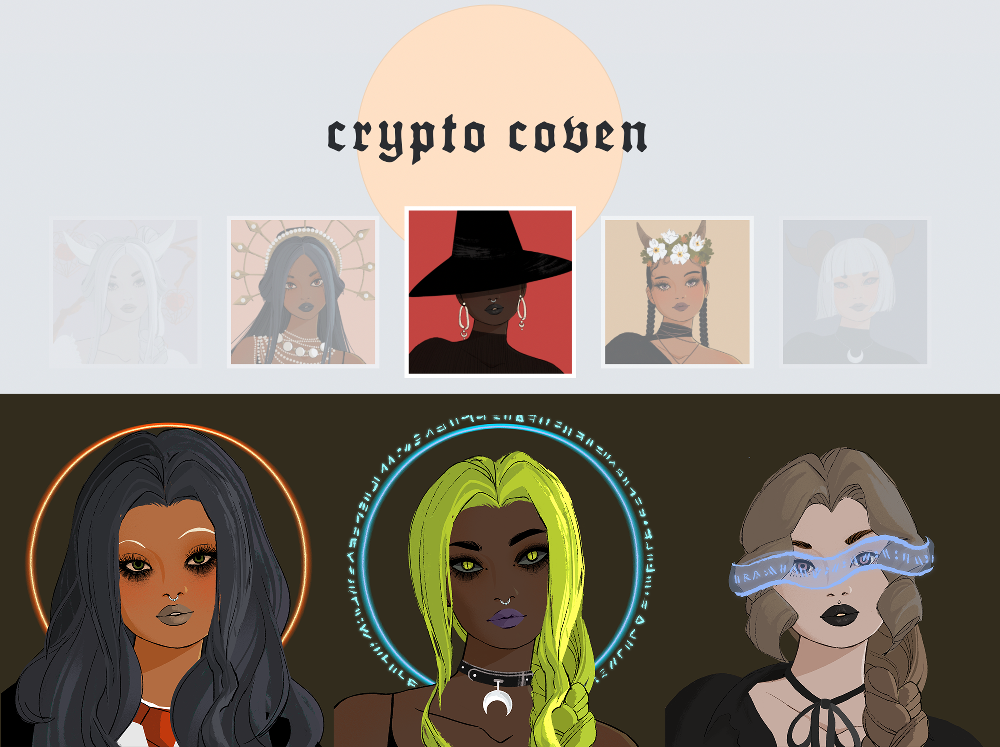

## Cryptocoven subgraph



### How to use the API

Try it out [here](https://thegraph.com/hosted-service/subgraph/dabit3/cryptocovenapi)

Example query:

```graphql
{
  tokens(first: 5) {
    id
    tokenID
    tokenURI
    externalURL
    image 
    name 
    description
    type 
    sun 
    moon 
    rising 
    updatedAtTimestamp 
    owner {
      id 
    }
  }
}
```

Filtering

```graphql
{
  tokens(
    where: {
      sun_contains: "capricorn"
    }
  ) {
    sun 
    name
  }
}
```

Full text search

```graphql
{
  covenSearch(
    text: "'CRUSH PEARLS IN YOUR FISTS'"
  ) {
    id
    name
    description
  }
}
```


### How to deploy the API

This project is an example of how you can build and deploy Graph Protocol APIs for NFT projects.

This subgraph indexes data from [Cryptocoven](https://etherscan.io/address/0x5180db8F5c931aaE63c74266b211F580155ecac8) smart contract transactions and makes them queryable.

This API enables advanced querying capabilities like full text search, relationships between tokens and users, filtering, sorting, and pagination.

To deploy this API, follow these steps:

1. Clone this repo, change into the directory, and install the dependencies:

```sh
git clone git@github.com:dabit3/cryptocoven-api.git

cd cryptocoven-api

npm install
```

2. Visit The Graph [hosted service dashboard](https://thegraph.com/hosted-service/), create a profile, and create a new subgraph by clicking __Add Subgraph__.

3. Install The Graph CLI:

```sh
npm install -g @graphprotocol/graph-cli
```

4. Authenticate the your CLI environment with the __Access Token__ from your account dashboard:

```
graph auth https://api.thegraph.com/deploy/ <ACCESS_TOKEN>
```

5. Replace `username/apiname` in `package.json` with your username and apiname, for example: `dabit3/cryptocovenapi`

6. Deploy the subgraph

```sh
yarn deploy
```